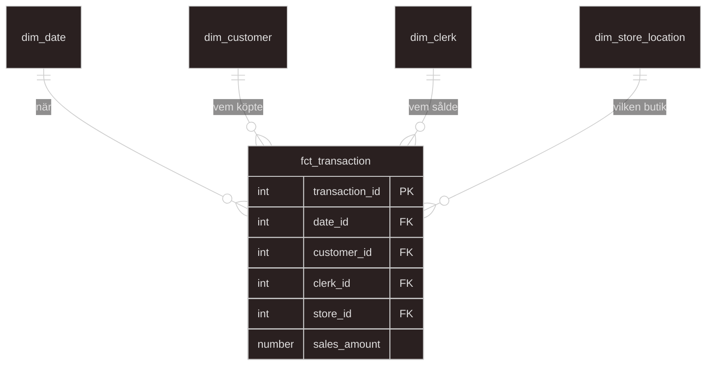

# Lecture notes for week 3 of data warehouse lifecycle course
## Class notes.
*Johnny Hyytiäinen*

Focus for week 3 will be the transforming step.

--- 
 
### Slides for week 3, lecture 08, 09 and 10. 

- [Dimensional modeling](weekly_slides/slides_dimensional_modeling.pdf)
- [Data marts](weekly_slides/slides_data_mart.pdf)
- [What is DBT?](weekly_slides/slides_what_is_dbt.pdf)
- [DBT development](weekly_slides/slides_dbt_development.pdf)

---

## Data modeling and specifically dimensional modeling - Why is it important?
Normalization, `1NF`, `2NF`, `3NF`.. ... is normally used for transactional databases(`OLTP`) and by normalizing a transactional database its meant to prevent data redundancy(duplication of rows or data that lives in several tables). Main purpose of these kinds of databases are for transactions.

Dimensional modeling however is mostly built for `SELECT`-statements and optimized for speed downstream. Normal characteristics for dimensional modeling is: Dimensional modeling is easy to understand, second is speed.

- `OLTP`: many small writes (`INSERT`/`UPDATE`), each touching a few rows, thousands of times a day.
- `OLAP`: few large reads (`SELECT`), each scanning and aggregating millions of rows.

## Data marts
- Downstream users(serving layer) take advantage of `marts` - Already prebuild `VIEW`(virtual) tables that are ready for serving the data for the users utilizing data that is already aggregated and optimized for speed. The serving layer should never do any heavy lifting.

---

## Fact and dimensional tables
The usage of a `Star schema` or `fact` and `dimensional` tables are used to separate facts from dimensions.
Facts should be something that is quantitive. Easy "rule of thumb" is to think of it like this:

- A fact table gets updated a lot.
    - In this ERD below the facts are the table that gets updated frequently.
        - A customer makes a `TRANSACTION` in a store which happens several times per day.
        - The `DAILY SALES` total updates with every `TRANSACTION`
- A dim table rarely gets updated.
    - In this ERD below hte dimensions are the tables that rarely gets updated.
        - The Date the sale is made
        - The registered CUSTOMERS (can be changed depending, not completely sure if it fits here)
        - Which store `CLERK` that made the sale
        - Which `STORE LOCATION` the `TRANSACTION` was made in

---

